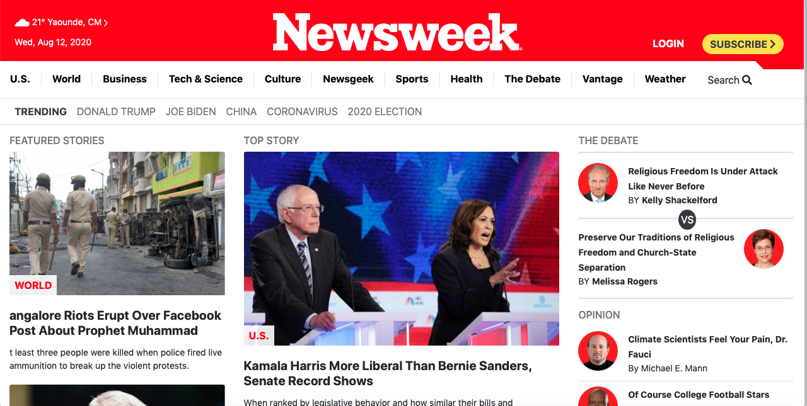

# USING BOOTSTRAP

Building a web page that matches the appearance of this page [NEWS WEEK LANDING PAGE](https://www.newsweek.com/) using bootstrap.

# Built With

- [HTML](https://developer.mozilla.org/en-US/docs/Web/HTML)
- [Bootstrap](https://getbootstrap.com/)
- [CSS](https://www.w3schools.com/css/)
- [Fontawesome](https://fontawesome.com/)

# Original Page

  

# Live Demo
[Click here for Live Demo](https://raw.githack.com/t-yanick/using-bootstrap/practice/index.html)

# Getting Started

The repository for this project is open source and open for contributions. 
When you visit the [issues page](https://github.com/t-yanick/using-bootstrap/issues), click on code and you will find clone to the right of the page. You can either Download or copy the link and do a "git clone repository-link" in the terminal.
You will now have my project in your local machine and you are ready to start working on it.

# Author

### Tazoh Yanick Tazoh
- Github: [@t-yanick](https://github.com/t-yanick)
- Twitter: [@ElTazoh](https://twitter.com/ElTazoh)
- Linkedin: [Tazoh Yanick](https://linkedin.com/in/tazoh-yanick-5a978764)

# Contributing
Contributions, issues and feature requests are welcome!
Feel free to check the [issues page](https://github.com/t-yanick/using-bootstrap/issues).

# Show your support
If you like our work, please give us a :+1:

# Acknowledgments
- Microverse
- W3schools
- Freecodecamp
- Developer.mozilla
- Learnshayhowe
- Odin project
- Hackerthemes
- Getbootstrap

# License
This project is [MIT](https://opensource.org/licenses/MIT) licensed.